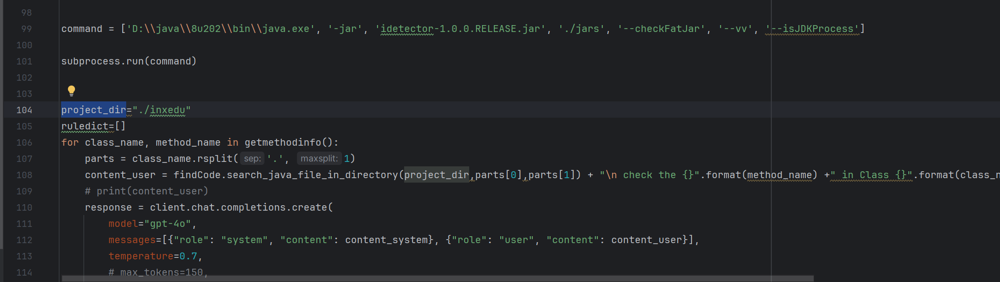

**Step 1**.  Place the jar or war package to be analyzed into the ./jars folder.

**Step 2**.  Fill in the project's source code directory in the start.py file (project_dir).

**Step 3**. run start.py.  The results will be stored in the ./results.

