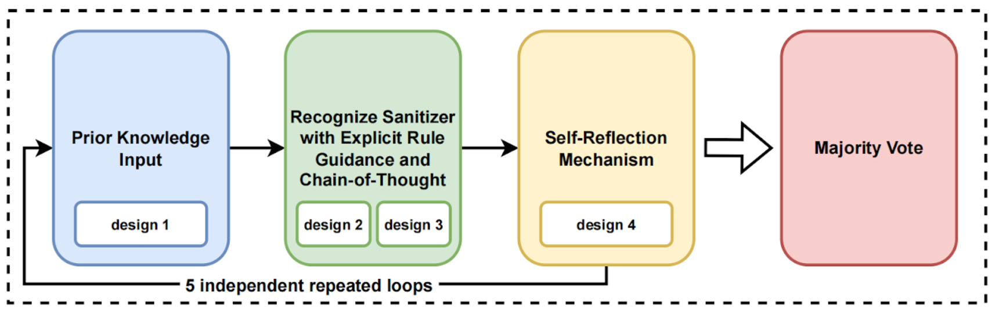

When using ChatGPT to identify potential sanitizers, we observed that GPT occasionally misidentified complex business logic as a filter function, due to hallucination issues. To improve sanitizer identification accuracy, we designed 22 prompts across four main categories: prior knowledge input, explicit rule guidance, Chain-of-Thought analysis, and self-reflection mechanism. Key details are as follows:

- **Prior Knowledge Input (2** prompts**)**: Examples of sanitizers for SQL injection and file operations to help ChatGPT recognize common sanitization patterns.
- **Explicit Rule Guidance (12** prompts**)**: Rules for identifying sanitizers, such as checking for SQL injection keywords and addressing file operation vulnerabilities like path traversal.
- **Chain-of-Thought Analysis (3** prompts**)**: Step-by-step analysis of function aspects (e.g., name, comments, logic) to enable systematic, accurate judgments.
- **Self-Reflection Mechanism (5** prompts**)**: A mechanism for self-checking and minimizing false positives by comparing against audit rules to ensure judgment accuracy.




When actually calling GPT, we merge designs 1, 2, and 3 together and send them to ChatGPT 4o through the OpenAI API. After receiving the return results from GPT, we submit the problems of designs 1, 2, and 3, the return results from GPT, and the prompt words of design 4 to GPT again. We repeat this process 5 times (three wins out of five) to reflect on the final result to ensure that the hallucination problem of GPT is alleviated to the greatest extent. The best-of-five self-validation loop was implemented via five distinct calls. 

**Design 1 (Prior Knowledge Input) : Leverage prior knowledge of sanitizers (e.g., specific examples).** 

Now, you are a professional code auditor, and your goal is to determine whether the function I provide is a sanitizer. Specifically, you need to assess whether this sanitizer is related to SQL injection or file operation sanitization. I will provide you with some examples of sanitizers, and your task is to learn from them to understand the sanitization operations.


SQL injection filtering is generally performed through whitelisting/blacklisting or pattern-based checks for the presence of sensitive keywords such as "select," "and," "or," "&," "|," or quotation marks. Below are examples of SQL injection sanitizers that I will provide to you:

```java
   protected static boolean sqlValidate(String str){

      String badStr =            "select|update|and|or|delete|insert|truncate|char|into|substr|ascii|declare|exec|count|master|into|drop|execute|table|"";

      // Matching using regular expressions

      boolean matches = str.matches(badStr);

      return matches;

    }
```

File upload or file read sanitization operations may either be directly embedded within business logic functions or abstracted into a general-purpose function to validate filenames or common characters. Typically, the validation involves checking the file extension type and whether the filename contains dangerous characters like ../ or ..  Or it will check the suffix, such as determining whether the filename is png, function isPNG()

 The following is a more general file upload sanitizer:

```java
 /**
   * Check File Suffix
   * @param size long file size
   * @param suffixName String suffixName
   */
     private void isValidPic(long size, String suffixName, String type) {
            
            JSONObject config = getConfig();

            if (!config.containsKey(type)) {

                throw new CrmebException("This type is not supported");

            }

            String supportNameSuffix = config.getJSONObject(type).getString("suffix");

            List<String> suffixNameList = CrmebUtil.stringToArrayStr(supportNameSuffix);

            if (!suffixNameList.contains(suffixName)) {

                throw new CrmebException("The file format must be" + supportSize);

            }

  }
```


**Design 2 (Explicit Rule Guidance) : Craft design prompt words to establish more comprehensive rules for recognizing sanitizers, enabling ChatGPT to identify them based on these rules.** 

```json
{
  "rule_for_chatgpt":"You are a professional code auditor, I will provide you with a Java class and method. You need to think **step by step** to help me determine whether the logic of this method involves security filtering for sql injection or filename check for file operation. Please strictly follow the audit_rule below for analysis.",

     "sql_filter_audit_rule1":"The sql injection filtering generally checks for the presence of sensitive keywords such as 'select','and','or','&','|' or quotes through black and white lists or regularity.",

    "sql_filter_audit_rule2":"For SQL injection sanitizerss, you need to determine whether the function is a general SQL injection filtering function for this project (It does not include business logic operations, only keyword checking and filtering. Other business functions can directly call this function for filtering operations.), rather than returning true simply because it contains some validation operations.",

    "sql_filter_audit_rule3":"If this function includes business logic operations, it is most likely not an SQL injection filtering function.",

    "sql_filter_audit_rule4":"I need to confirm whether this method is related to SQL injection filtering, not whether it poses an SQL injection risk.",

    "path_vulnerability_audit_rule1":"You must carefully confirm that functions related to file operation security filtering must check the filename suffix using blacklist or whitelist or check the presence of path traversal special strings like '../'",

    "path_vulnerability_audit_rule2":"For file operation filtering, it is most likely related to file upload, download, import, or export. There is no need to focus on business validations within other business functions.",

    "path_vulnerability_audit_rule3":"Do not return true simply because the function involves file upload or download operations. I need to confirm that the function includes filtering operations.",

    "audit_rule1":"Please exclude certain validations that are clearly unrelated to SQL injection and file operations, such as verifying user phone numbers, usernames, and similar operations.",

    "audit_rule2":"Please review only the filtering functions related to SQL injection and file operations. Other types of filtering functions are not within the scope of consideration.",

    "audit_rule3":"Functions specifically used for security filtering usually have highly targeted method names or class names, such as 'sqlfilter', 'project.tools.filter.commonFilter', etc.",

    "audit_rule4":"You can utilize the function's comment information to assist in identifying sanitizers. For instance, a sanitizer that checks file suffixes might have a comment like /** Check File Suffix **/.",

    "output":"Return the results to me in JSON format. If the method is security filtered, just respond with '{"isfilter": true,"reason": "xxxxx"}',else return '{"isfilter": false}'#Other than that, don't tell me anything."
    
}
```


**Design 3 (Chain-of-Thought Analysis) : Use thought chains for step-by-step problem identification. This approach allows GPT to analyze sanitizer characteristics (such as comments, function name, and content) in stages, improving accuracy.** 

You can proceed **step by step** to determine whether the function I submit to you is a sanitizer.

+ Step 1: If the function contains comments at the beginning, review the comments to get a general understanding of the function’s purpose.

+ Step 2: Check the function name and classname. If the name is something obvious like sqlfilter or checkFileName or project.tools.filter.commonFilter, it is highly likely to be a sanitizer.

+ Step 3: Review the function logic. This is the most crucial step. You need to apply prior knowledge to evaluate the function content I provide. 


**Design 4 (Self-Reflection Mechanism) : Implement a self-reflection mechanism. By identifying common false positives and refining the characteristics of  sanitizers, ChatGPT can self-assess its judgments, facilitating re-verification and enhancing accuracy.**

```json
{
  "rule_for_checker":"Now, you are a professional code auditor. I will provide you with the previous ChatGPT role setting rules, my questions, and ChatGPT's answers. You need to think step by step to help me verify the correctness of ChatGPT's judgment on sanitizers, following these audit rules.",
  "audit_rule1":"A statement like if (dirName != null && !''.equals(dirName.trim())) that simply checks if a string is empty cannot be considered a filtering operation. Many business operation functions contain a large number of checks for elements such as usernames, phone numbers. It is incorrect to consider a function as a sanitizer simply because it includes numerous business logic checks.",
    
    "audit_rule2":"User permission checks cannot be considered filtering operations, such as verifying if a user is an administrator or has a logged-in status",

    "audit_rule3":"A function that contains an obvious path traversal filter for patterns like ../ or .. in its content can be considered a filtering function.",

    "audit_rule4":"A function that contains obvious filters for SQL-sensitive keywords such as and, or, update, ', and \" in its content can be considered an SQL injection filtering function. note that: Some sanitizers may mix sql and xss filtering together, and this counts as sanitizers",

    "output":"Return the results to me in JSON format",

    output_format if as below

    {
      "istrue": false,
      "reason":"give me the reason why ChatGPT's previous answer was incorrect."
    }
}
```

